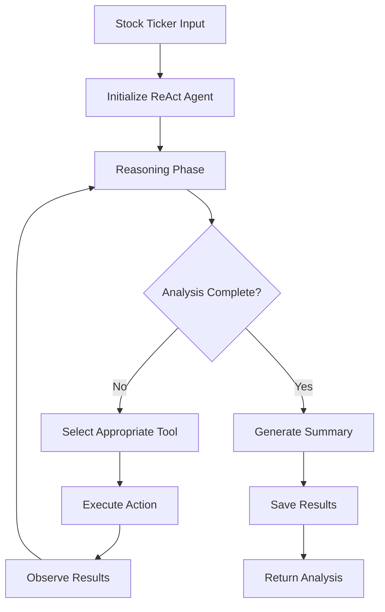

# StockSense Agent

**AI-Powered Autonomous Stock Market Research (ReAct Pattern)**

StockSense is an autonomous stock analysis system implementing the **ReAct (Reasoning + Action)** pattern: iterative reasoning, selective tool invocation, and adaptive summarization. The agent collects real market data (news + historical prices), performs LLM-based sentiment analysis, and produces a structured summary.

[](https://www.python.org/downloads/)
[](https://fastapi.tiangolo.com/)
[](https://streamlit.io/)
[](https://langchain-ai.github.io/langgraph/)
[](https://python.langchain.com/)
[](LICENSE)

## Overview

StockSense demonstrates an applied AI agent architecture using LangGraph + LangChain tools. It combines recent news headlines (NewsAPI) and historical market data (Yahoo Finance via yfinance) with Gemini-based sentiment analysis (Gemini 2.0 Flash Lite) to produce a lightweight research snapshot. The agent maintains internal state (messages, tool usage, reasoning steps) across iterations until completion criteria are met or a max-iteration limit is reached.

### Key Characteristics

- **ReAct Agent**: Iterative reasoning cycle with tool calls (news, price data, sentiment, persistence)
- **Backend API**: FastAPI service exposing analysis endpoints and cached result retrieval
- **Frontend App**: Streamlit dashboard for interactive analysis + visualization
- **LLM Integration**: Google Gemini 2.0 Flash Lite (chat + text variants) via `langchain-google-genai`
- **Stateful Orchestration**: LangGraph `StateGraph` with conditional continuation
- **Caching Layer**: Lightweight SQLite persistence (custom functions, no ORM layer)

## Architecture

### Technology Stack

| Layer            | Technology                               | Purpose                             |
| ---------------- | ---------------------------------------- | ----------------------------------- |
| **LLM / AI**     | Google Gemini 2.0 Flash Lite (LangChain) | Sentiment & reasoning               |
| **Agent Graph**  | LangGraph (StateGraph)                   | Iterative reasoning & tool routing  |
| **Tool Layer**   | LangChain `@tool` functions              | News, price, sentiment, persistence |
| **Backend**      | FastAPI + Uvicorn                        | REST API (analysis, cache, health)  |
| **Frontend**     | Streamlit                                | Interactive dashboard & charts      |
| **Persistence**  | SQLite (custom helper functions)         | Cached analyses                     |
| **Data Sources** | NewsAPI + yfinance (Yahoo Finance data)  | Headlines + OHLCV price history     |
| **Config / Env** | `python-dotenv`                          | API key management                  |

### ReAct Agent Workflow



### Core Components

```
StockSense-Agent/
├── app.py                  # Streamlit UI
├── requirements.txt        # Frontend/minimal dependency set
├── requirements-backend.txt# Backend + agent + LLM dependencies (pin-locked)
├── nasdaq_screener.csv     # Reference ticker list (auxiliary)
├── DEPLOYMENT.md           # Backend (Render) & frontend (Streamlit Cloud) instructions
├── stocksense/
│   ├── main.py             # FastAPI server (analysis + cache endpoints)
│   ├── react_agent.py      # LangGraph ReAct agent implementation
│   ├── data_collectors.py  # NewsAPI + yfinance helper functions
│   ├── analyzer.py         # Sentiment analysis (Gemini prompt)
│   ├── database.py         # SQLite caching helpers
│   └── config.py           # Configuration & LLM/chat factories
├── data/                   # Created at runtime if DB path resolves here
├── tests/
│   ├── test_api.py         # API integration tests (optional server running)
│   └── test_tools.py       # Tool logic tests
└── readme.md               # Project documentation
```

Note: No Dockerfiles or docker-compose file are present in the repository at this time.

## Features

### Autonomous Agent

- Iterative reasoning loop via LangGraph (agent → tools → agent)
- Dynamic tool usage: news, price data, sentiment analysis, save
- Prevents redundant tool calls (checks existing state)
- Max iteration guard (default 8)

### Market Data & Sentiment

- Recent headline aggregation (NewsAPI)
- Historical OHLCV price retrieval (yfinance)
- Per-headline sentiment request + overall summary (Gemini 2.0 Flash Lite)
- Fallback keyword-based sentiment visualization heuristic

### Infrastructure

- FastAPI backend (analysis trigger, cached retrieval, health)
- Streamlit dashboard (interactive charts + summaries)
- SQLite caching (automatic path fallback resolution)
- Simple environment-based configuration validation

## Quick Start

### Prerequisites

- Python 3.10+
- [Google Gemini API Key](https://aistudio.google.com/app/apikey)
- [NewsAPI Key](https://newsapi.org/register)

### Installation

Choose environment scope:

1. Frontend only (Streamlit + basic data fetch) – `requirements.txt`
2. Full backend + agent (FastAPI, LangGraph, Gemini) – `requirements-backend.txt`

```bash
git clone https://github.com/Spkap/StockSense-Agent.git
cd StockSense-Agent

# Option A: Frontend only
python -m venv venv
source venv/bin/activate
pip install -r requirements.txt

# Option B: Full backend + agent
python -m venv venv
source venv/bin/activate
pip install -r requirements-backend.txt

# Environment variables (required for analysis)
echo "GOOGLE_API_KEY=your_actual_google_api_key_here" >> .env
echo "NEWSAPI_KEY=your_actual_newsapi_key_here" >> .env

# (Optional) Pre-create SQLite DB (auto-created on first save)
python -c "from stocksense.database import init_db; init_db()"
```

### Usage Options

#### Full Stack

```bash
# Terminal 1 – backend API
python -m stocksense.main  # http://127.0.0.1:8000

# Terminal 2 – frontend UI
streamlit run app.py       # http://localhost:8501
```

#### (No Docker Artifacts Present)

Docker instructions removed (no Dockerfiles / compose file currently in repo).

#### REST API

```bash
# Trigger ReAct agent analysis
curl -X POST "http://localhost:8000/analyze/AAPL"

# Retrieve cached results
curl "http://localhost:8000/results/AAPL"

# System health check
curl "http://localhost:8000/health"

# Get all cached tickers
curl "http://localhost:8000/cached-tickers"
```

#### Command Line

```bash
python -m stocksense.main
```

### Example Analysis Output (Illustrative)

```json
{
  "ticker": "AAPL",
  "summary": "Apple Inc. demonstrates strong market sentiment with positive outlook...",
  "sentiment_report": "Overall Sentiment: Positive ...",
  "headlines_count": 18,
  "reasoning_steps": [
    "Analyzing request for AAPL stock",
    "Fetching recent news headlines (7 days)",
    "Collecting historical price data (30 days)",
    "Performing AI sentiment analysis",
    "Generating comprehensive summary"
  ],
  "tools_used": [
    "fetch_news_headlines",
    "fetch_price_data",
    "analyze_sentiment"
  ],
  "iterations": 3,
  "agent_type": "ReAct"
}
```

## API Reference

### Endpoints

| Method | Path                | Purpose                                    |
| ------ | ------------------- | ------------------------------------------ |
| POST   | `/analyze/{ticker}` | Run ReAct agent (fresh or cached shortcut) |
| GET    | `/results/{ticker}` | Latest cached summary & sentiment          |
| GET    | `/cached-tickers`   | List all cached tickers                    |
| GET    | `/health`           | Basic health status                        |
| GET    | `/`                 | Welcome metadata                           |
| GET    | `/docs`             | Swagger UI                                 |
| GET    | `/redoc`            | ReDoc docs                                 |

### Python Integration

```python
from stocksense.react_agent import run_react_analysis

result = run_react_analysis("AAPL")
print(result["summary"][:400])
print("Tools used:", result["tools_used"])
```

## Testing

```bash
# All tests (requires backend deps installed)
pytest -v

# Individual modules
pytest tests/test_api.py -v
pytest tests/test_tools.py -v

# Optional coverage
pytest --cov=stocksense --cov-report=term-missing

# Component quick runs
python -m stocksense.react_agent
python -m stocksense.analyzer
```

### Test Scope

- ReAct reasoning & tool orchestration
- FastAPI endpoints (health, cached tickers, root)
- Response structure & basic latency expectations
- Tool data formatting (headline list, OHLCV serialization)

## Deployment

See `DEPLOYMENT.md` for Render + Streamlit Cloud instructions. No container artifacts currently provided.

## Technical Highlights

### Implementation Notes

- LangGraph workflow: agent node + tool node + conditional edge
- State tracks tools used, reasoning steps, iterations, messages
- Redundant tool invocations avoided (sentiment/news/price dedupe)
- SQLite path resolver with environment override + graceful fallbacks
- Gemini rate limit handling produces user-friendly summary
- OHLCV serialization for frontend charts

### Potential Enhancements

- Add Docker & CI workflows
- Structured sentiment parsing / scoring normalization
- Additional analytical metrics (volatility, volume anomalies)
- Enhanced test coverage for failure branches

### Disclaimer

Example outputs are illustrative; actual results depend on live NewsAPI & yfinance data plus Gemini responses.
